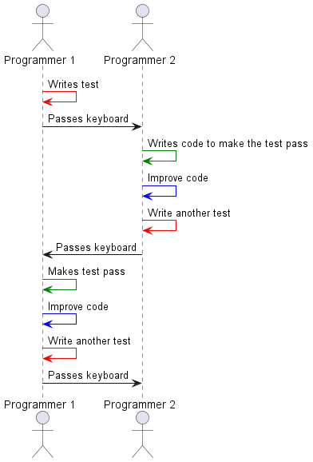
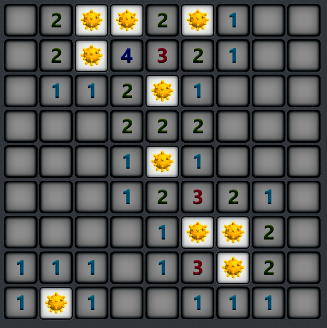

# Learning Test-Driven Development and pair programming with minesweeper

The goal of this lecture is to learn effective programming techniques
which will be the foundation for the rest of the course

Learning goals:

1. See pair programming practiced
2. See test-driven development practiced
3. Solve the "minesweeper" exercise

## Pair programming and test driven development



## Mine sweeper



## The minesweeper exercise ("minesweeper kata")

Generate a minesweeper board so that a user can play it. Given a set of
mines places on a board, generate the number that should be displayed on
every square of the minesweeper board.

For example, given this board:

```
..**.*...
..*......
....*....
.........
....*....
.........
.....**..
......*..
.*.......
```

Then the following output should be created:

```
02**2*100
02*432100
0112*1000
000222000
0001*1000
000123210
00001**20
111013*20
1*1001110
```

## Steps

* [ ] Create project
* [ ] Write a failing test for the smallest and simplest possible minefield. See it fail. Commit
* [ ] Switch programmer - write super simple implementation. See test run green. Commit
* [ ] Write next test - change the dimensions of the minefield. See it fail. Commit
* [ ] Switch programmer. Make the test pass. Commit
* [ ] Write next test - simplest minefield with mines. See it fail. Commit

## Test progression

* [x] 1x1 empty minefiedl
* [x] 1x3 empty minefield
* [x] 3x4 empty minefield
* [ ] 3x3 minefield with all mines
* [ ] 2x1 minefield with a mine
* [ ] 5x1 minefield with a mine in the middle
* [ ] 1x5 minefield with a mine in the middle
* [ ] 3x3 minefield with a mine in the middle
* [ ] 3x3 minefield with some mines
* [ ] Example from above

